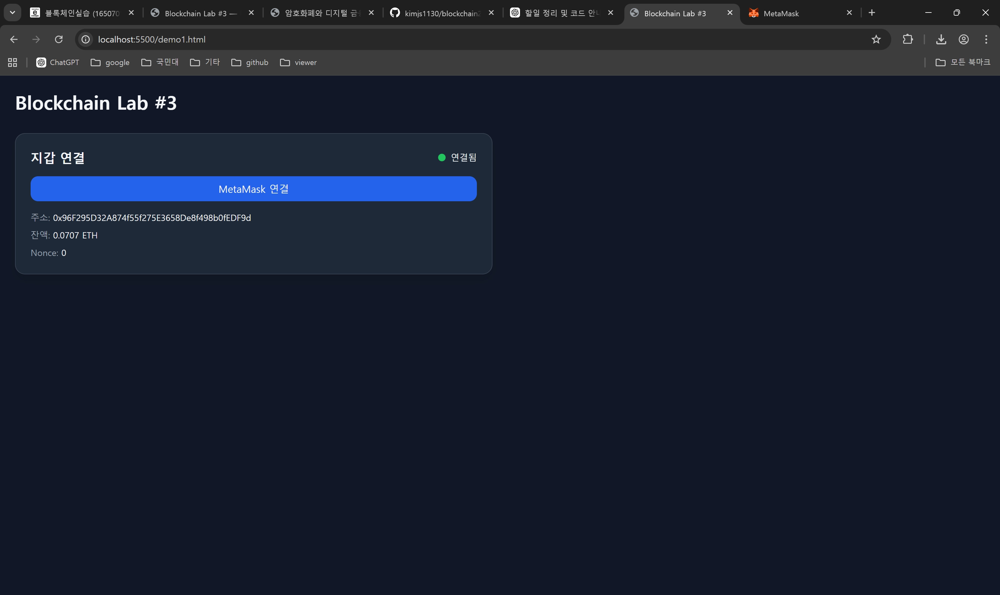
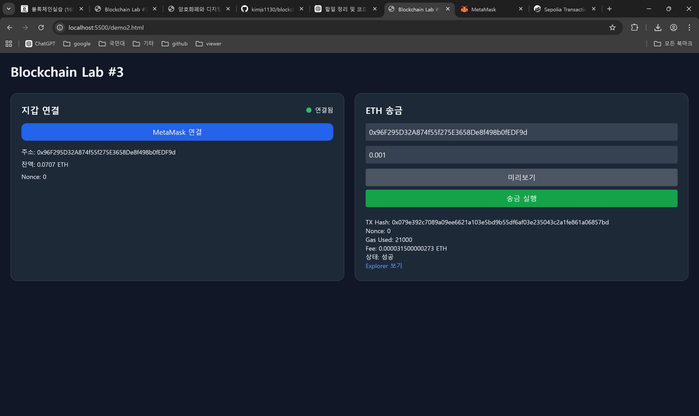
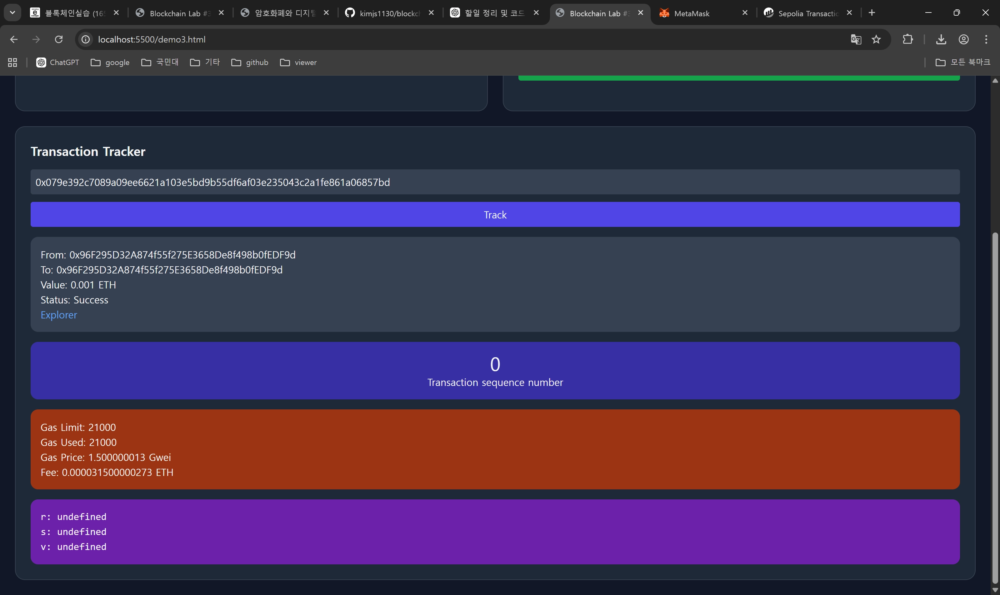

# 🚀 Blockchain Lab #3

## 📌 프로젝트 개요

본 프로젝트는 **HTML + Tailwind CSS + ethers.js v6**를 활용하여 제작한
간단한 블록체인 대시보드입니다.

Ethereum **Sepolia 테스트넷**을 기반으로 다음 기능을 구현했습니다:

* MetaMask 지갑 연결
* ETH 송금
* 트랜잭션 추적

---

## 🛠 사용 기술

* HTML (단일 파일)
* Tailwind CSS (CDN)
* ethers.js v6
* MetaMask
* Ethereum Sepolia Testnet

---

## 🧩 주요 기능

### 1️⃣ 지갑 연결 (Wallet Connection)

* MetaMask 연결
* 지갑 정보 표시:

  * 주소 (Address)
  * 잔액 (Balance)
  * Nonce
* 연결 상태 표시 (🟢 Connected / ⚪ Disconnected)
* 잔액 0일 경우 Faucet 안내 메시지 출력

---

### 2️⃣ ETH 송금 (Send ETH)

* 입력:

  * 받는 주소
  * 송금 금액

* 기능:

  * 주소 검증 (`ethers.getAddress`)
  * 미리보기 (Nonce, Gas Limit)
  * MetaMask 서명 후 전송
  * 블록 포함 대기 (`tx.wait()`)

* 결과 표시:

  * TX Hash
  * Nonce
  * Gas Used
  * 수수료 (Fee)
  * 상태 (Success / Fail)
  * Explorer 링크

* 예외 처리:

  * 잘못된 주소
  * 금액 오류 (0 이하)
  * 사용자 거절 (MetaMask)
  * 잔액 부족

---

### 3️⃣ 트랜잭션 추적 (Transaction Tracker)

* TX Hash 입력 → 트랜잭션 조회

* 표시 정보:

  * 기본 정보 (From, To, Value, Status)
  * Nonce
  * Gas 정보 (Limit, Used, Price, Fee)
  * Signature (r, s, v)

---

## ⚙️ 핵심 구현

### Provider 설정

```js
const provider = new ethers.BrowserProvider(window.ethereum);
const readProvider = new ethers.JsonRpcProvider(rpcUrl);
```

### RPC 설정

```js
const rpcUrl = "https://ethereum-sepolia.publicnode.com";
```

> 기본 RPC는 불안정하여 publicnode 사용

---

### Gas 계산 (EIP-1559 대응)

```js
const gasPrice = receipt.effectiveGasPrice ?? tx.gasPrice ?? 0n;
const fee = receipt.gasUsed * gasPrice;
```

---

### 트랜잭션 전송

```js
const tx = await signer.sendTransaction({
  to,
  value: ethers.parseEther(amount)
});
await tx.wait();
```

---

## ▶️ 실행 방법

### ✅ 방법 1: VS Code Live Server (추천)

1. VS Code에서 프로젝트 폴더 열기
2. `demo3.html` 우클릭
3. **"Open with Live Server" 클릭**
4. 브라우저 자동 실행

---

### ✅ 방법 2: 직접 실행 (HTML)

```bash
demo3.html 파일 더블 클릭
```

---

### ✅ 방법 3: Python 서버 실행

```bash
python -m http.server 5500
```

브라우저 접속:

```bash
http://localhost:5500/demo3.html
```

---

## 📂 파일 구성

```
demo1.html → 지갑 연결
demo2.html → ETH 송금
demo3.html → 트랜잭션 추적
```

---

## 🖼 실행 결과

### 🔹 지갑 연결 화면

# 🚀 Blockchain Lab #3

## 📌 프로젝트 개요

본 프로젝트는 **HTML + Tailwind CSS + ethers.js v6**를 활용하여 제작한
간단한 블록체인 대시보드입니다.

Ethereum **Sepolia 테스트넷**을 기반으로 다음 기능을 구현했습니다:

* MetaMask 지갑 연결
* ETH 송금
* 트랜잭션 추적

---

## 🛠 사용 기술

* HTML (단일 파일)
* Tailwind CSS (CDN)
* ethers.js v6
* MetaMask
* Ethereum Sepolia Testnet

---

## 🧩 주요 기능

### 1️⃣ 지갑 연결 (Wallet Connection)

* MetaMask 연결
* 지갑 정보 표시:

  * 주소 (Address)
  * 잔액 (Balance)
  * Nonce
* 연결 상태 표시 (🟢 Connected / ⚪ Disconnected)
* 잔액 0일 경우 Faucet 안내 메시지 출력

---

### 2️⃣ ETH 송금 (Send ETH)

* 입력:

  * 받는 주소
  * 송금 금액

* 기능:

  * 주소 검증 (`ethers.getAddress`)
  * 미리보기 (Nonce, Gas Limit)
  * MetaMask 서명 후 전송
  * 블록 포함 대기 (`tx.wait()`)

* 결과 표시:

  * TX Hash
  * Nonce
  * Gas Used
  * 수수료 (Fee)
  * 상태 (Success / Fail)
  * Explorer 링크

* 예외 처리:

  * 잘못된 주소
  * 금액 오류 (0 이하)
  * 사용자 거절 (MetaMask)
  * 잔액 부족

---

### 3️⃣ 트랜잭션 추적 (Transaction Tracker)

* TX Hash 입력 → 트랜잭션 조회

* 표시 정보:

  * 기본 정보 (From, To, Value, Status)
  * Nonce
  * Gas 정보 (Limit, Used, Price, Fee)
  * Signature (r, s, v)

---

## ⚙️ 핵심 구현

### Provider 설정

```js
const provider = new ethers.BrowserProvider(window.ethereum);
const readProvider = new ethers.JsonRpcProvider(rpcUrl);
```

### RPC 설정

```js
const rpcUrl = "https://ethereum-sepolia.publicnode.com";
```

> 기본 RPC는 불안정하여 publicnode 사용

---

### Gas 계산 (EIP-1559 대응)

```js
const gasPrice = receipt.effectiveGasPrice ?? tx.gasPrice ?? 0n;
const fee = receipt.gasUsed * gasPrice;
```

---

### 트랜잭션 전송

```js
const tx = await signer.sendTransaction({
  to,
  value: ethers.parseEther(amount)
});
await tx.wait();
```

---

## ▶️ 실행 방법

### ✅ 방법 1: VS Code Live Server (추천)

1. VS Code에서 프로젝트 폴더 열기
2. `demo3.html` 우클릭
3. **"Open with Live Server" 클릭**
4. 브라우저 자동 실행

---

### ✅ 방법 2: 직접 실행 (HTML)

```bash
demo3.html 파일 더블 클릭
```

---

### ✅ 방법 3: Python 서버 실행

```bash
python -m http.server 5500
```

브라우저 접속:

```bash
http://localhost:5500/demo3.html
```

---

## 📂 파일 구성

```
demo1.html → 지갑 연결
demo2.html → ETH 송금
demo3.html → 트랜잭션 추적
```

---

## 🖼 실행 결과

### 🔹 지갑 연결 화면


---

### 🔹 ETH 송금 화면


---

### 🔹 트랜잭션 추적 화면


---

## ⚠️ 문제 해결

### ❌ Track 버튼 동작 안할 때

* TX hash 오류
* 트랜잭션 아직 미확정 (pending)
* RPC 문제

✔ 해결 방법:

* 10~30초 대기 후 재시도
* Sepolia Etherscan에서 확인
* RPC 변경

---

### ❌ 잔액 부족

* Faucet에서 Sepolia ETH 수령 필요

---

### ❌ MetaMask 없음

* 확장 프로그램 설치 필요

---

## 🌐 네트워크 정보

* Ethereum Sepolia Testnet
* Explorer: https://sepolia.etherscan.io

---

## 👨‍💻 작성자




### 🔹 ETH 송금 화면


---

### 🔹 트랜잭션 추적 화면



---

## ⚠️ 문제 해결

### ❌ Track 버튼 동작 안할 때

* TX hash 오류
* 트랜잭션 아직 미확정 (pending)
* RPC 문제

✔ 해결 방법:

* 10~30초 대기 후 재시도
* Sepolia Etherscan에서 확인
* RPC 변경

---

### ❌ 잔액 부족

* Faucet에서 Sepolia ETH 수령 필요

---

### ❌ MetaMask 없음

* 확장 프로그램 설치 필요

---

## 🌐 네트워크 정보

* Ethereum Sepolia Testnet
* Explorer: https://sepolia.etherscan.io

---

## 👨‍💻 작성자

김지석
