# Solidity Lab Simulator - Lab 1

## 📌 프로젝트 개요
브라우저에서 Solidity 스마트 컨트랙트를 작성하고, 컴파일/배포/함수 실행을 체험할 수 있는 간단한 Solidity Lab Simulator입니다.

## ⚙️ 실행 방법
### 1. 파일 실행
아래 방법 중 하나 선택

### 방법 1 (추천)
```bash
start lab1.html
```

### 방법 2 (python 서버)
```bash
python -m http.server 8000
```

브라우저 접속:

```text
http://localhost:8000/lab1.html
```

## 🧪 실습 내용
### ✔ Combined Contract
- `greeting` (string)
- `number` (int)

### ✔ 구현 기능
getter 함수
- `getGreeting()`
- `getNumber()`

setter 함수
- `setGreeting()`
- `setNumber()`

## 🔍 실습 목표
### 1. public vs private 비교
- `public` → 자동 getter 생성
- `private` → 직접 getter 필요

### 2. 상태 변경 확인
- setter 실행 후 값 변경 확인

## 🖥️ 실행 화면
아래는 실행 결과 화면입니다.

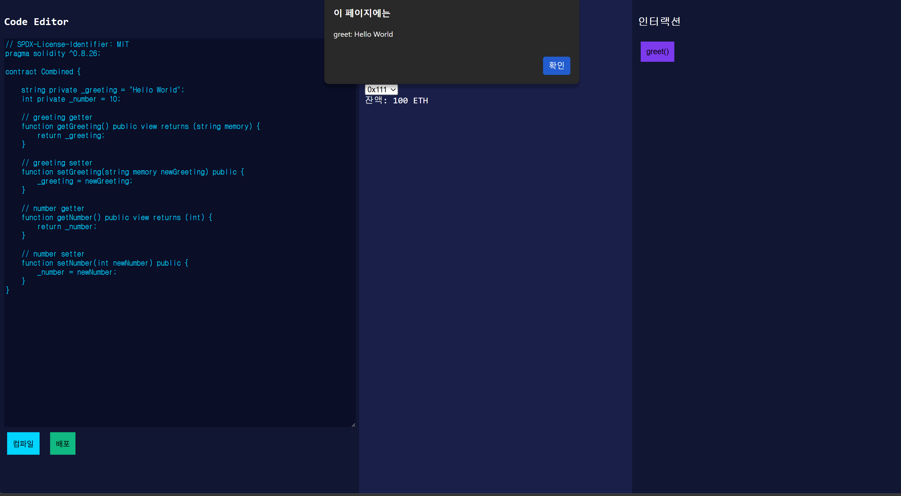

## 🧩 기능 설명
### ✔ 컴파일
- Solidity 코드 검증

### ✔ 배포
- 컨트랙트 상태 초기화

### ✔ 인터랙션
- getter 버튼 → 값 조회
- setter 함수 → 값 변경

## 🔥 체크리스트
- [x] greeting 조회 가능
- [x] number 조회 가능
- [x] setter로 값 변경 가능
- [x] public → private 변경 실험 완료

## 🚀 추가 과제
### Faucet Contract 구현
- ETH를 요청하면 일정량 지급하는 스마트 컨트랙트 작성

## 📎 파일 구조
```text
lab1.html
README.md
screenshot.png
```

## ✅ 결론
Solidity의 상태 변수 접근 방식(public/private)과 getter/setter 개념을 실습으로 이해하는 것이 목표입니다.

---

## 📚 추가 실습 정리
아래 이미지는 이번 채팅에서 진행한 실습 과정을 정리한 캡처입니다.

### 1. Counter.sol 배포 화면
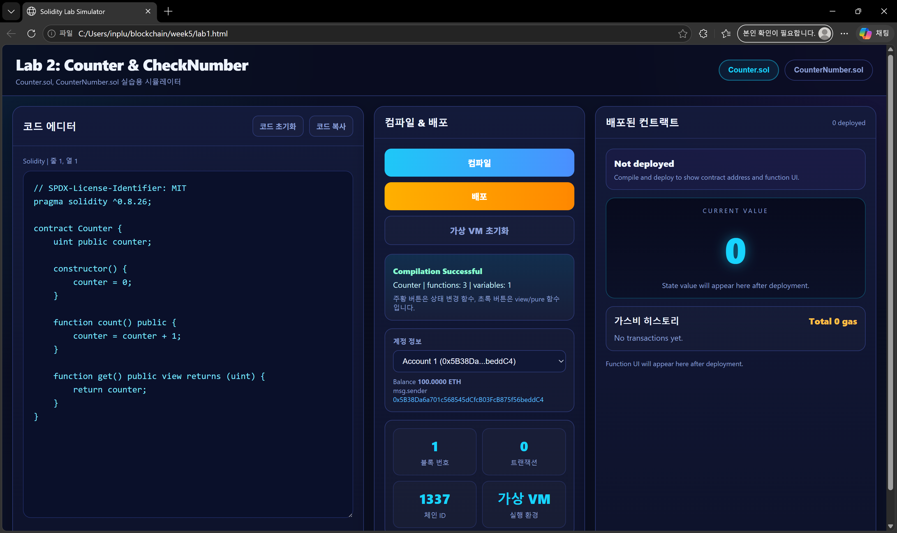

`Counter.sol`을 선택하고 컴파일 및 배포를 진행한 화면입니다.  
배포가 완료되면 오른쪽 패널에 컨트랙트 주소와 상태값 표시 영역이 생성되는 것을 확인했습니다.

### 2. Counter.sol 함수 확인
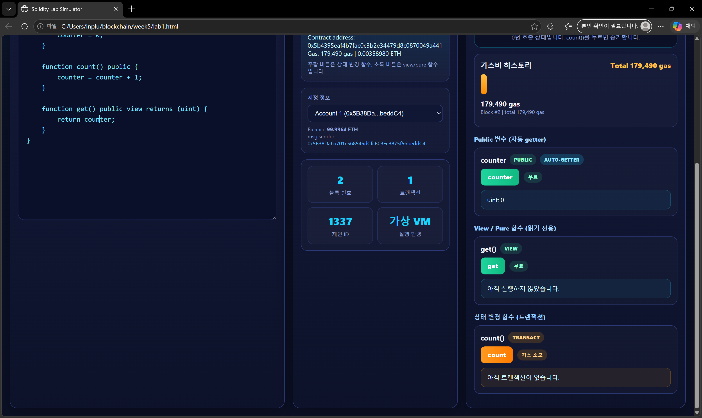

`counter()`와 `get()` 같은 읽기 함수, `count()` 같은 상태 변경 함수를 구분해서 확인했습니다.  
읽기 함수와 상태 변경 함수가 서로 다른 역할을 가진다는 점을 실습으로 확인했습니다.

### 3. Counter.sol 상태 증가 결과
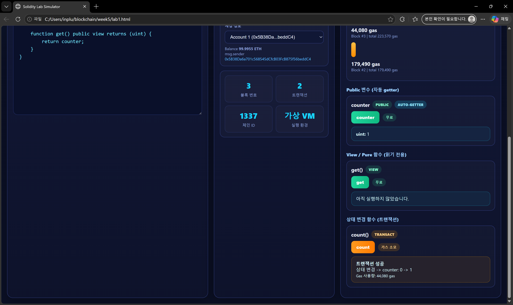

`count()`를 실행한 뒤 카운터 값이 증가한 화면입니다.  
이 과정을 통해 배포 후 상태값이 실제로 변경된다는 점을 확인했습니다.

### 4. CounterNumber.sol 초기값 조회
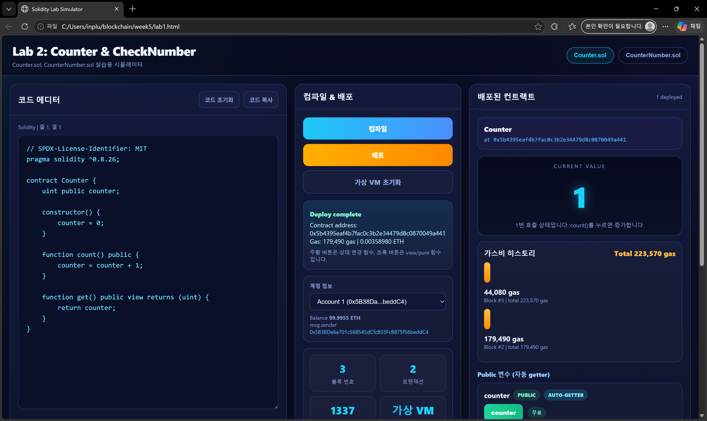

`CounterNumber.sol`에서 숫자 상태 변수의 초기값을 조회한 화면입니다.  
getter 함수로 현재 값을 확인하는 흐름을 실습했습니다.

### 5. CounterNumber.sol 값 변경
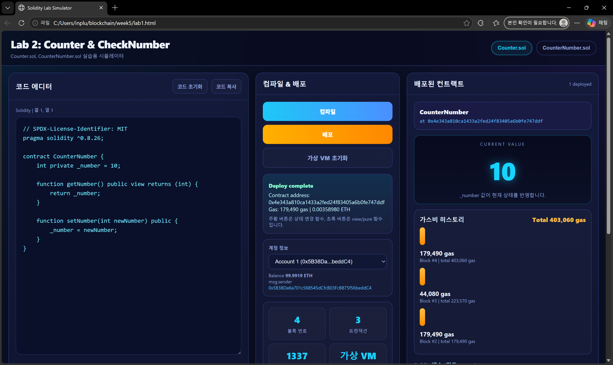

새 숫자를 입력한 뒤 `setNumber()`를 실행하고, 다시 `getNumber()`로 변경 결과를 확인했습니다.  
`private` 변수와 getter / setter 구조를 직접 사용하는 흐름을 이해했습니다.

### 6. Faucet.sol 배포
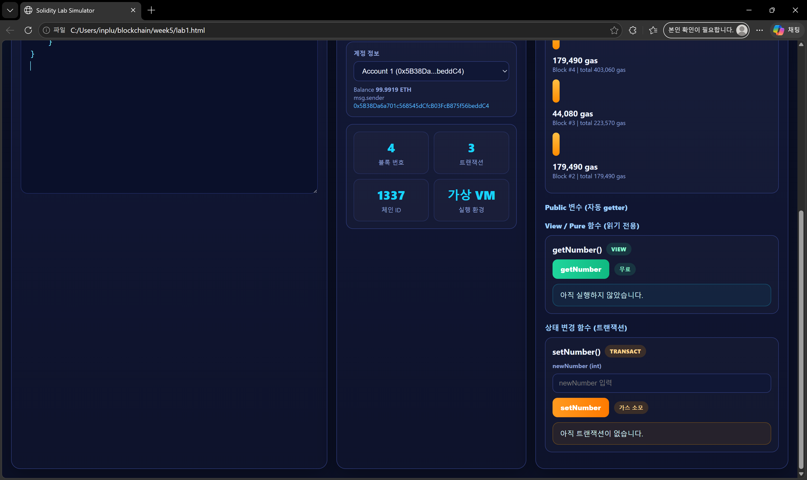

`Faucet.sol`을 컴파일하고 배포한 화면입니다.  
배포 당시 선택한 계정이 자동으로 `owner`가 되는 구조를 확인했습니다.

### 7. Faucet 핵심 상태 확인
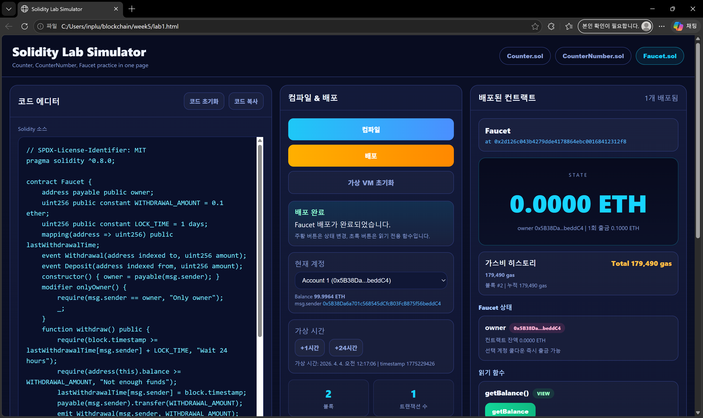

`owner`, `WITHDRAWAL_AMOUNT`, `LOCK_TIME`, `lastWithdrawalTime` 등 Faucet의 핵심 상태를 확인했습니다.  
이 구조를 통해 owner 권한과 출금 제한이 어떻게 연결되는지 이해했습니다.

### 8. Faucet 입금 흐름
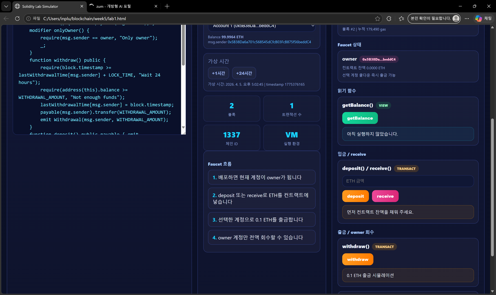

`deposit()` 또는 `receive()`를 통해 컨트랙트 잔액을 먼저 채우는 과정을 확인했습니다.  
입금이 먼저 되어야 이후 `withdraw()`가 가능하다는 점을 정리했습니다.

### 9. Faucet 출금 흐름
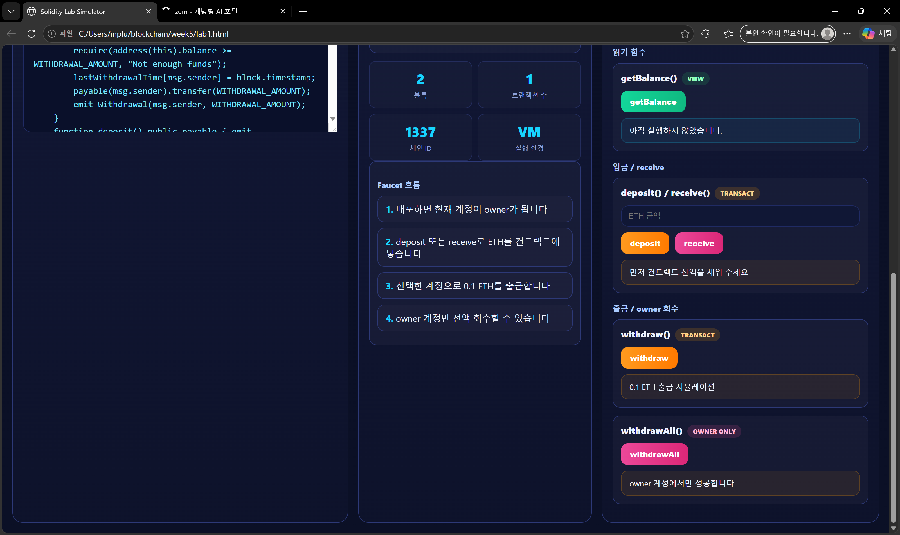

`withdraw()`를 실행해 0.1 ETH가 출금되는 흐름을 확인했습니다.  
출금 후에는 컨트랙트 잔액이 줄어드는 구조를 실습했습니다.

### 10. Faucet 시간 제한 확인
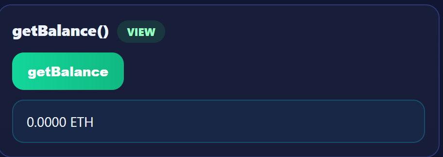

출금 직후 다시 `withdraw()`를 시도하면 바로 성공하지 않는 구조를 확인했습니다.  
이 과정을 통해 `LOCK_TIME = 1 days`의 의미를 확인했습니다.

### 11. Faucet owner 개념 확인
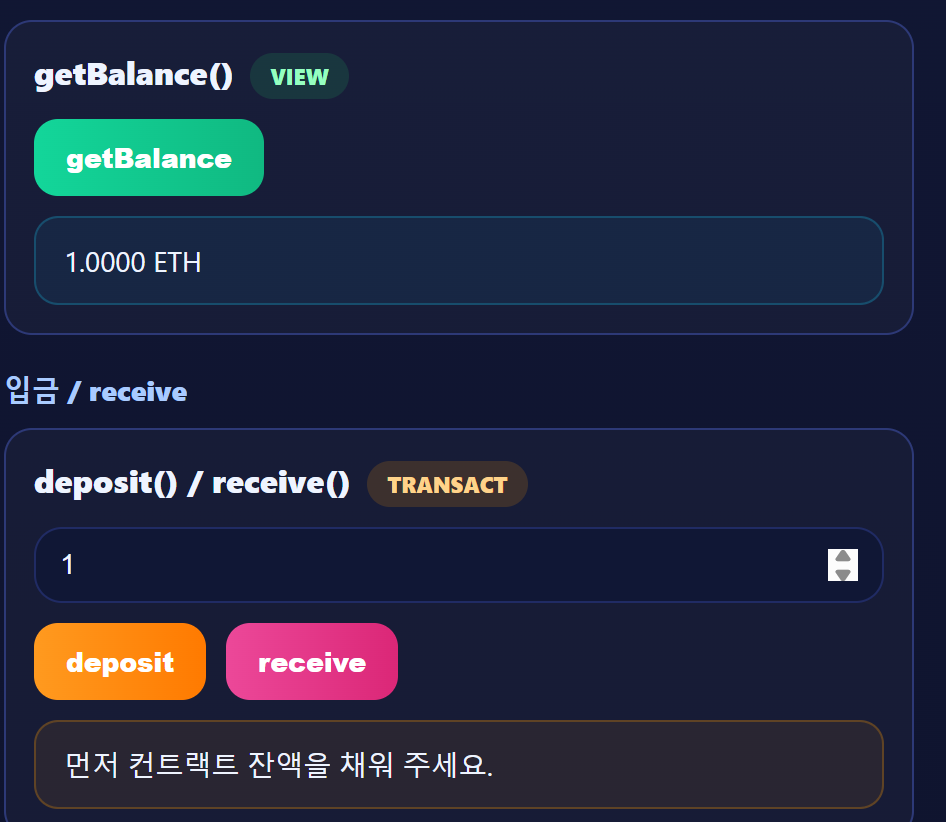

`withdrawAll()`은 owner 계정에서만 성공해야 하므로, 배포 시 선택한 계정이 중요하다는 점을 확인했습니다.  
즉, owner 권한 제어가 Faucet의 핵심 보안 요소라는 점을 정리했습니다.

### 12. Faucet 권한 차이 확인
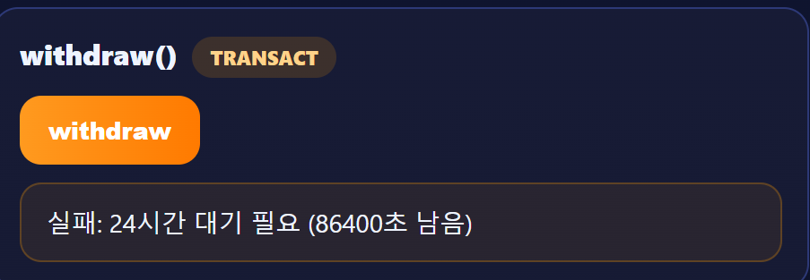

일반 계정과 owner 계정이 서로 다른 권한을 가진다는 점을 확인했습니다.  
`withdraw()`와 `withdrawAll()`의 차이를 비교하면서 권한 제어를 이해했습니다.

### 13. Faucet 회수 이후 상태 확인
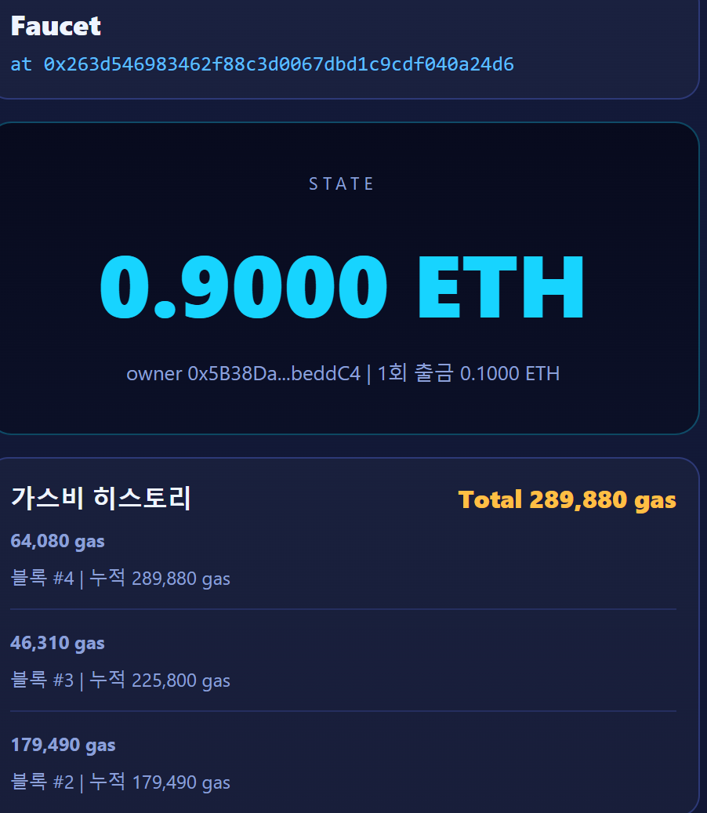

전액 회수 이후 컨트랙트 잔액이 줄어들거나 0이 되는 상태를 기준으로 결과를 확인했습니다.  
`withdrawAll()`의 목적이 faucet에 남은 자금을 owner가 회수하는 것이라는 점을 확인했습니다.

### 14. Faucet 전체 흐름 정리
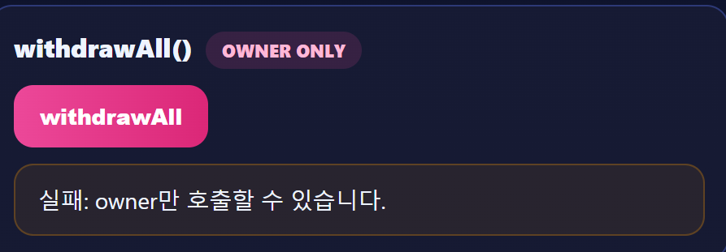

마지막으로 `배포 -> 입금 -> 출금 -> owner 회수`의 전체 흐름을 다시 정리했습니다.  
이번 과제에서는 이 과정을 시뮬레이터와 Solidity 코드 파일을 함께 사용해 실습했습니다.
