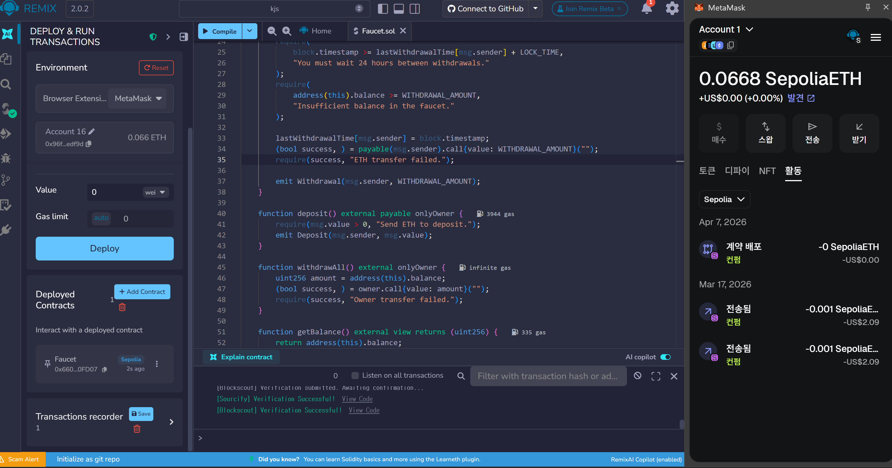
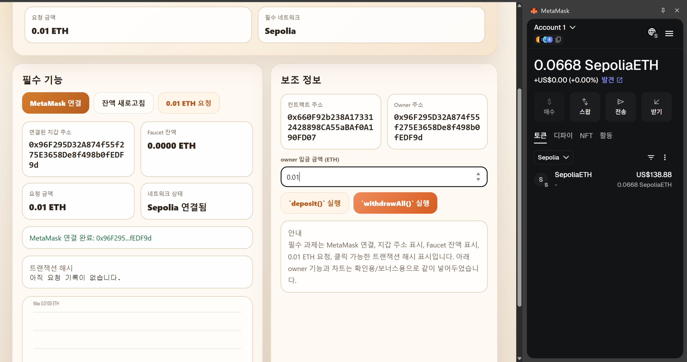
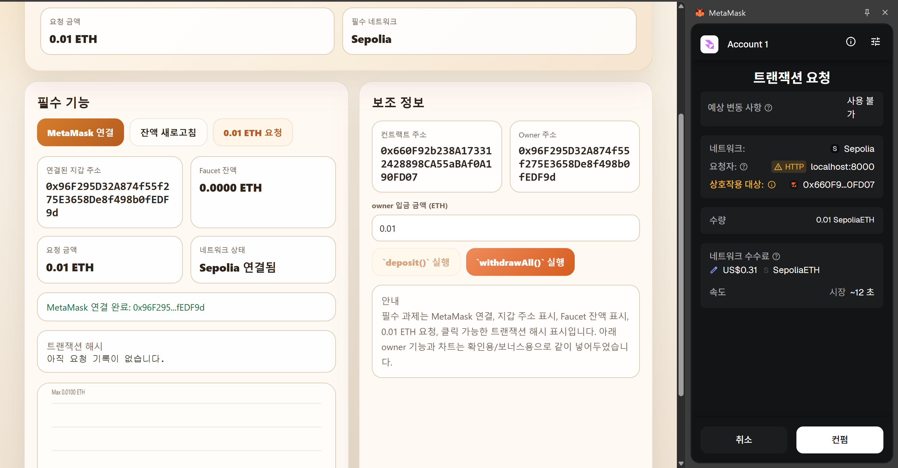
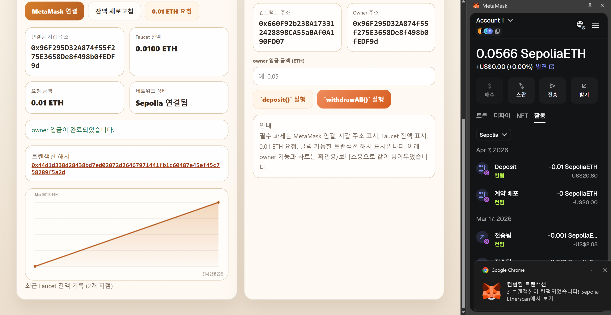
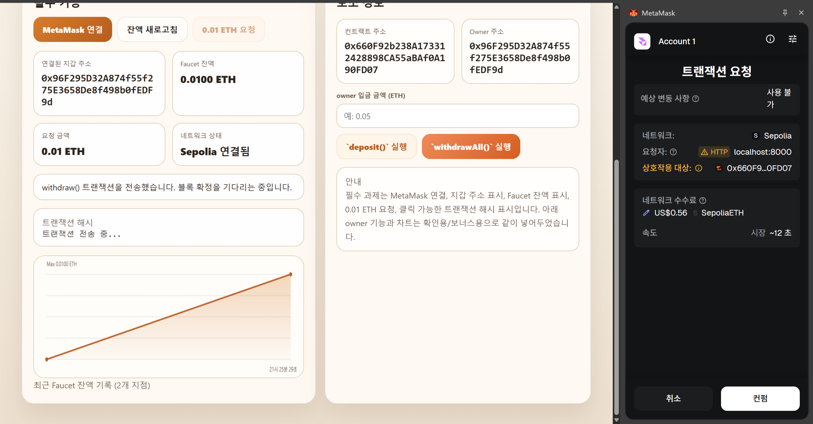
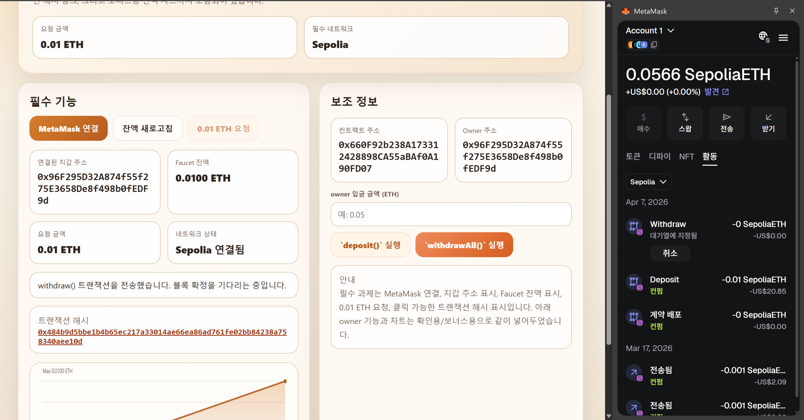
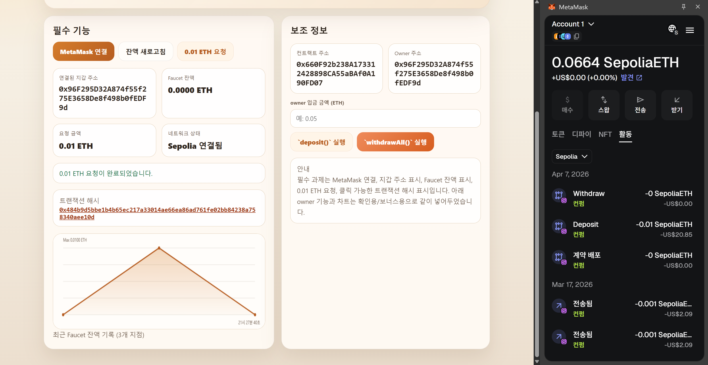
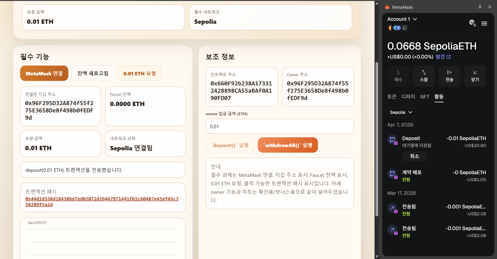
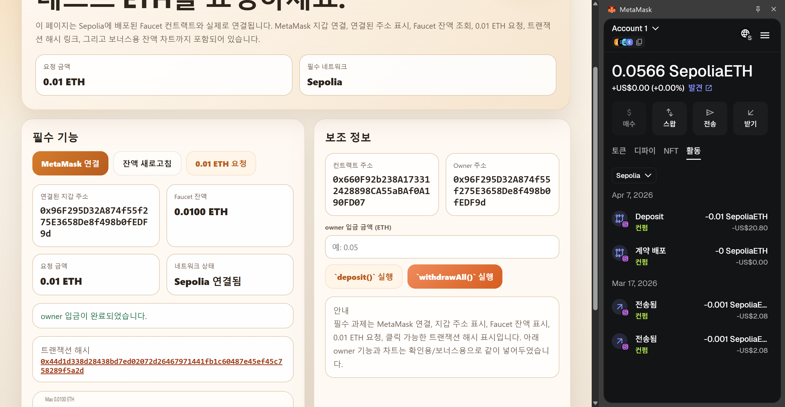

# Week 6 Faucet DApp 보고서

## 1. 과제 개요
이번 과제의 목표는 무료 테스트 ETH를 지급하는 `Faucet` 스마트 컨트랙트를 작성하고, 사용자가 MetaMask를 통해 해당 컨트랙트와 상호작용할 수 있는 `faucet.html` 페이지를 구현하는 것이다.

구현한 주요 기능은 다음과 같다.

- MetaMask 지갑 연결
- 연결된 지갑 주소 표시
- Faucet 잔액 표시
- 요청 금액 `0.01 ETH` 표시
- `withdraw()` 호출을 통한 ETH 요청
- 클릭 가능한 트랜잭션 해시 표시
- 보너스: Faucet 잔액 변화 차트 표시

## 2. 제출 파일
- `Faucet.sol`
- `faucet.html`
- `README.md`
- `img_0.png` ~ `img_8.png`

## 3. 스마트 컨트랙트 설명
`Faucet.sol`에는 다음 기능을 구현하였다.

- `owner`: 컨트랙트 배포자를 저장하는 상태 변수
- `WITHDRAWAL_AMOUNT`: 한 번 요청할 때 지급되는 금액 (`0.01 ether`)
- `LOCK_TIME`: 동일 주소가 다시 요청하기까지의 제한 시간 (`1 days`)
- `withdraw()`: 사용자가 테스트 ETH를 요청하는 함수
- `deposit()`: owner가 Faucet에 ETH를 충전하는 함수
- `withdrawAll()`: owner가 Faucet 잔액 전체를 회수하는 함수
- `getBalance()`: Faucet 잔액을 조회하는 함수

또한 `transfer` 경고를 피하기 위해 ETH 전송은 `call{value: ...}("")` 방식으로 구현하였다.

## 4. 웹페이지 설명
`faucet.html`은 Sepolia 테스트 네트워크에 배포된 Faucet 컨트랙트와 연결되는 페이지로 작성하였다.

웹페이지에서 확인 가능한 항목은 다음과 같다.

- MetaMask 연결 버튼
- 연결된 지갑 주소
- Faucet 잔액
- 요청 금액 `0.01 ETH`
- 네트워크 상태
- 트랜잭션 해시
- owner 전용 입금 기능
- owner 주소
- Faucet 잔액 차트

## 5. 수행 과정

### 5-1. Remix에서 Faucet 컨트랙트 배포
Remix의 `Deploy & Run Transactions`에서 `Browser Extension - MetaMask` 환경으로 설정한 뒤, `Faucet.sol`을 Sepolia 네트워크에 배포하였다.

배포 후 `Deployed Contracts`에 생성된 주소를 확인하고, 해당 주소를 `faucet.html`의 컨트랙트 주소로 사용하였다.

### 5-2. MetaMask 연결 및 페이지 초기 상태 확인
`faucet.html`을 `localhost` 환경에서 실행한 뒤 MetaMask를 연결하였다. 이 단계에서 연결된 지갑 주소, 컨트랙트 주소, owner 주소, 요청 금액, 네트워크가 올바르게 표시되는지 확인하였다.

### 5-3. owner 입금 금액 입력
Faucet이 ETH를 지급하려면 먼저 owner가 ETH를 충전해야 하므로, 입금 금액을 입력한 뒤 `deposit()` 실행을 준비하였다.

### 5-4. deposit 트랜잭션 승인
owner 계정에서 `deposit()`을 실행하면 MetaMask에 Sepolia 트랜잭션 요청 창이 나타나고, 이를 승인하여 Faucet에 ETH를 충전하였다.

### 5-5. owner 입금 완료 확인
입금이 완료되면 상태 메시지에 owner 입금 완료가 표시되고, Faucet 잔액이 `0.0100 ETH`로 증가한 것을 확인하였다. 동시에 트랜잭션 해시도 페이지에 기록된다.

### 5-6. withdraw 트랜잭션 요청
이후 `0.01 ETH 요청` 버튼을 눌러 `withdraw()`를 실행하였다. MetaMask에서 해당 트랜잭션을 승인하여 Faucet에서 ETH를 요청하였다.

### 5-7. withdraw 전송 및 대기 상태 확인
트랜잭션을 전송한 직후에는 상태창에 `withdraw()` 전송 메시지가 표시되며, MetaMask 활동 내역에서도 요청이 대기 중인 것을 확인할 수 있었다.

### 5-8. withdraw 완료 후 결과 확인
트랜잭션이 완료되면 Faucet 잔액이 `0.0000 ETH`로 감소하고, 요청 완료 메시지와 함께 클릭 가능한 트랜잭션 해시가 표시되었다. 아래 차트에는 Faucet 잔액 변화도 함께 반영되었다.

### 5-9. 추가 입금 동작 재확인
추가로 owner가 다시 입금하는 동작도 반복 확인하였다. 이를 통해 Faucet이 한 번의 요청 이후에도 다시 충전되어 재사용될 수 있음을 확인하였다.

## 6. 결과 정리
이번 과제를 통해 Sepolia 테스트 네트워크에 스마트 컨트랙트를 배포하고, 웹페이지에서 MetaMask를 연결하여 실제로 Faucet 컨트랙트와 상호작용하는 과정을 확인하였다.

확인한 결과는 다음과 같다.

- MetaMask 연결이 정상적으로 동작한다.
- 연결된 지갑 주소가 웹페이지에 표시된다.
- Faucet 잔액이 ETH 단위로 표시된다.
- 요청 금액 `0.01 ETH`가 명확히 표시된다.
- `withdraw()` 실행 후 트랜잭션 해시가 클릭 가능한 링크 형태로 표시된다.
- owner 계정은 `deposit()`과 `withdrawAll()`을 사용할 수 있다.
- 차트를 통해 Faucet 잔액 변화 과정을 시각적으로 확인할 수 있다.

## 7. 결론
이번 과제를 통해 Solidity 스마트 컨트랙트 작성, Sepolia 배포, MetaMask 연동, 트랜잭션 처리 결과 확인까지 전체 흐름을 직접 구현하고 확인하였다. 특히 단순한 컨트랙트 작성에 그치지 않고, 사용자가 웹페이지에서 실제로 연결하고 요청하는 DApp 형태로 확장했다는 점에서 과제 목표를 충실히 수행하였다.
